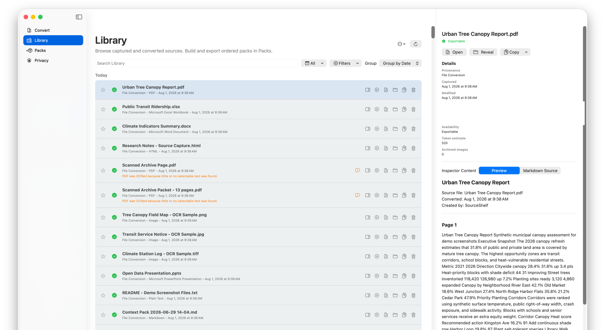

# Library and Inspector

Library is the source browser. It is deliberately separate from Packs: filtering Library never opens, reorders, or changes a saved pack. SourceShelf retains Library entries until you explicitly remove them; it does not automatically discard older sources.

## Search and filters

Search matches source details such as titles and origins. Filters can narrow the Library by:

1. search text;
2. date;
3. source origin;
4. content type;
5. availability status;
6. saved-pack membership.

Active filters appear as removable chips in that order. Removing a chip resets only that filter. **Reset All** clears all active filters.

## Source status

- A green status indicates readable Markdown.
- A warning calls attention to a source or archived asset issue.
- An unavailable source remains in Library when its Markdown cannot currently be read.
- A saved-pack placeholder remains visible even if its Library record is missing, so it can still be reordered or removed.

SourceShelf intentionally omits a repeated “Exportable” label from healthy rows. Select the item or inspect its status when you need details.

## Row actions

When the window is wide enough, Library rows show individual action icons with tooltips. In less space, the same actions move into a menu. Depending on the item, actions include:

- Show Details;
- Add to or remove from the current pack;
- Open Markdown;
- Reveal in Finder;
- Copy Path;
- Star or unstar;
- Remove from Library.

Removing an item from Library does not delete its generated Markdown. Saved-pack references remain as placeholders.

## Inspector

At wider window sizes, the inspector is a third resizable column. Near the minimum window width, it opens as a sheet so Library or both pack-building columns remain usable.

The inspector shows:

- full title and provenance;
- capture and modification dates;
- local source and output paths;
- current availability and warnings;
- estimated tokens and archived-image count;
- Open, Reveal, and Copy actions;
- **Preview** and **Markdown Source** tabs.

The preview reads at most 256 KiB from the local Markdown file. It strips only leading YAML before rendering, retains spacing and block structure, and does not fetch remote images or other remote assets. The source tab preserves YAML and exact Markdown text. A truncation notice links to **Open Markdown** when the file is larger.

## Maintenance

The Library maintenance menu can remove missing entries or clear unstarred history. These actions operate on Library records, not generated Markdown files.

For storage cleanup, open **Settings > General > Review Storage…**. Safe Cleanup is limited to orphaned managed data, obsolete caches, expired capture staging, and revoked MCP snapshots. Generated Markdown cleanup requires selecting the affected sources and confirmation; output is moved to Trash, while original imported documents are never touched. Starred and saved-pack sources are locked unless you deliberately enable protected-source selection. See [Manage SourceShelf Storage](storage-management.md) for a guided walkthrough.
