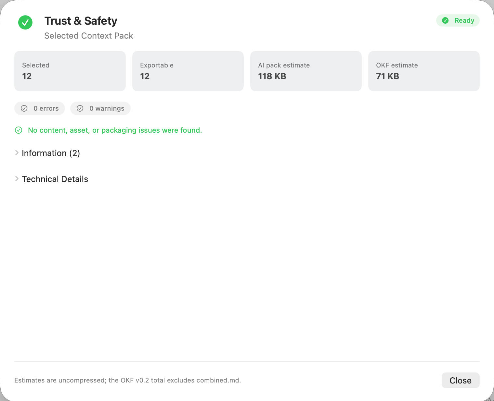
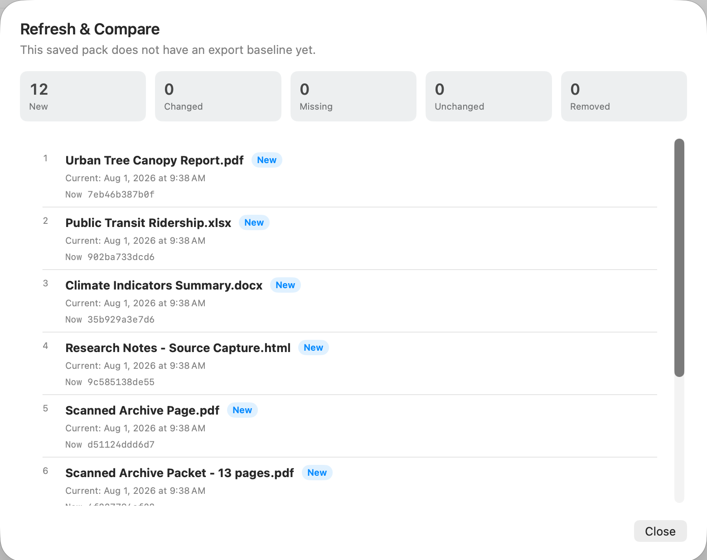

# Confianza y seguridad y paquetes en evolución

Trust & Safety te ayuda a inspeccionar un paquete antes de que salga de SourceShelf o se vuelva disponible para otra aplicación local. Es un informe de asesoramiento, no una garantía de que el contenido sea seguro.

## Qué comprobaciones realiza SourceShelf

El informe incluye comprobaciones de:

- fuentes legibles e inaccesibles;
- referencias de paquetes guardados no resueltas;
- tamaño de la salida y el número de imágenes archivadas;
- nomenclatura, colisión y estructura del paquete;
- sumas de verificación de archivos de origen y empaquetados;
- fechas de modificación;
- capturas web más antiguas que la política de antigüedad aplicable;
- referencias de activos e enlaces inválidas;
- probablemente una instrucción de sobrepaso, divulgación solicitada por el sistema, uso de herramientas, credenciales o lenguaje de exfiltración.

El detector de riesgos es intencionalmente conservador. Los resultados muestran una categoría, una línea Markdown y un breve extracto. Los ejemplos dentro de código encerrado reciben una severidad reducida o suprimida en la medida de lo posible.

## Contenido de referencia no confiable

El material capturado y convertido se clasifica como `untrusted_reference`. documentos de contexto generados y MCP Las lecturas incluyen un aviso visible. SourceShelf preserva el cuerpo original para que puedas revisarlo; no elimina las instrucciones ni describe el material como desinfectado.

## Listos, advertencias y errores

- **dispuesto** significa que las comprobaciones estructurales compartidas pasaron y no hay ningún problema asesor que necesite ser revisado.
- **Advertencias** permita la exportación o el intercambio después de revisar el informe.
- **Errores con fuentes legibles** puede seguir permitiendo una continuación explícita de "con problemas".
- **Sin fuentes legibles** bloquea la exportación o el intercambio porque no hay nada útil que entregar.

La validación de exportación estructural sigue siendo autorizada. Si la validación del paquete falla, SourceShelf no escribe un resultado inválido.

## ranciedad

Las capturas web utilizan una edad predeterminada global de 90 días. Una receta de captura puede heredar ese valor, elegir un número positivo de días o desactivar la antigüedad basada en la edad para sus capturas.

Las conversiones de archivos se comparan a través de las fechas de modificación y los hashes de contenido, no mediante un umbral de edad arbitrario. SourceShelf nunca descarga un URL para decidir si una página web ha cambiado.

## Actualizar y comparar

Después de una exportación exitosa, SourceShelf almacena una base de datos para ese paquete guardado. seleccionar **Actualizar y comparar** para clasificar el estado local actual:

- **nuevo** — en el paquete actual pero ausente de la línea de base;
- **Cambiado** — el contenido semántico o los metadatos de procedencia rastreada difieren;
- **Fallecido** — referenciado pero actualmente ilegible o no disponible;
- **Sin cambios** — los hashes de metadatos contenidos y rastreados coinciden;
- **Eliminado** — presente en el momento de la exportación, pero ya no en el paquete guardado.

Los cambios en el orden se reportan por separado. La hoja de detalles muestra las fechas actuales y de exportación más recientes, además de hashes acortados. El contenido correspondiente y los hashes de metadatos coincidentes se clasifican como sin cambios.

Los paquetes sin título no tienen bases de referencia persistentes. Guarda el paquete primero. La cancelación o un fallo de exportación no actualizan la base de referencia; si la exportación tiene éxito pero la persistencia de la base de referencia falla, SourceShelf informa de un fallo de seguimiento en lugar de reclamar que el paquete es actual.

## Cuando los informes se vuelven anticuados

Los cambios en la membresía, el pedido, el paquete activo, el estado de origen, la política de recetas y la línea de base anulan los resultados anteriores de Trust & Safety o de comparación. Realice la comprobación de nuevo antes de confiar en ellos.
