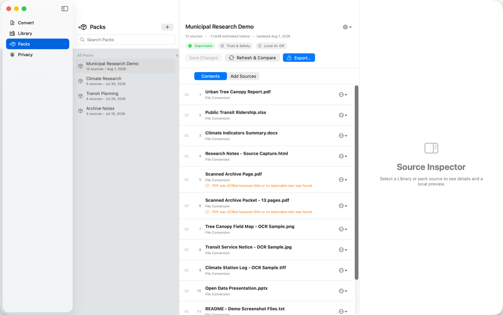

# Créer et gérer des packs

Un pack est un ensemble ordonné de sources de bibliothèque. Les packs enregistrés sont les collections durables de SourceShelf et l'unité utilisée pour l'exportation, la comparaison et l'accès local à l'IA.

## L'espace de travail des packs

La colonne de gauche est un navigateur de bibliothèque compact. La colonne centrale est le pack trié. À des largeurs de fenêtre plus importantes, l'inspecteur apparaît comme une troisième colonne ; à des largeurs compactes, il s'ouvre dans une feuille.

Utilisez le champ de tête pour sélectionner un pack enregistré, en créer un nouveau, enregistrer les modifications, enregistrer sous un nom différent, renommer ou le supprimer.

## Ajouter et commander des sources

- Sélectionnez le contrôle plus ou moins à côté d'une source pour changer l'adhésion.
- **Ajouter des correspondances** Ajoute des sources lisibles correspondant aux filtres actuels du navigateur.
- **Ajouter tout exportable** Ajoute toutes les sources de la bibliothèque lisibles.
- **Ajouter depuis la dernière exportation** Ajoute des sources créées après l'exportation la plus récente réussie du pack actuel.
- Faites glisser les sources pour les réorganiser, ou utilisez **Avancer** et **Avancer vers le bas** Pour la commande accessible par clavier.

Exportateurs et MCP Les instantanés reçoivent les sources dans l'ordre affiché.

## Dossiers et sauvegarde explicite

Les modifications du pack sont des brouillons jusqu'à ce que vous sélectionniez. **économiser** ou **Sauvegarder les modifications**. SourceShelf restaure le pack actif, les commandes et les métadonnées du brouillon non sauvegardées après le redémarrage, mais l'instantané du brouillon ne contient jamais de contenu Markdown.

Si vous changez de pack ou si vous commencez un nouveau pack pendant que le projet actuel est sale, SourceShelf vous offre :

- **économiser** Pour persister dans les changements actuels et continuer ;
- **jeter** Pour revenir à l'adhésion enregistrée et continuer ;
- **annuler** Pour rester sur le projet actuel.

Un sauvegarde échoué laisse le projet sale et annule le commutateur demandé.

## Enregistrer sous, renommer et supprimer

**Enregistrer sous** crée un autre pack sauvegardé. Si son nom normalisé entre en collision avec un pack existant, SourceShelf demande avant de remplacer quoi que ce soit.

Le changement de nom modifie le nom du pack sauvegardé utilisé pour les titres des packs et les métadonnées de la collection de manifeste. La suppression d'un pack sauvegardé ne supprime pas les entrées de la bibliothèque ni les fichiers Markdown. Si vous supprimez le pack actif, ses contenus se détachent dans un brouillon sale sans titre.

## Références manquantes

Les références enregistrées sont conservées lorsque l'un des éléments de la bibliothèque ou un fichier Markdown devient indisponible. L'emplacement de remplacement peut toujours être réorganisé ou supprimé. Trust & Safety signale la référence non résolue comme une erreur, tout en permettant l'exportation lorsque l'une des autres sources est lisible.

## Les packs deviennent "vivants" après l'exportation.

Un enregistrement d'exportation réussi enregistre une ligne de base locale contenant la commande, les hachages, les dates et le format d'exportation. **Recharger et comparer** Compare l'état actuel de la bibliothèque locale avec cette ligne de base. Il ne revisite jamais un site Web. URL.

voir [Confiance et sécurité et packs de vie](trust-safety-and-refresh.md) Pour les significations de comparaison.
