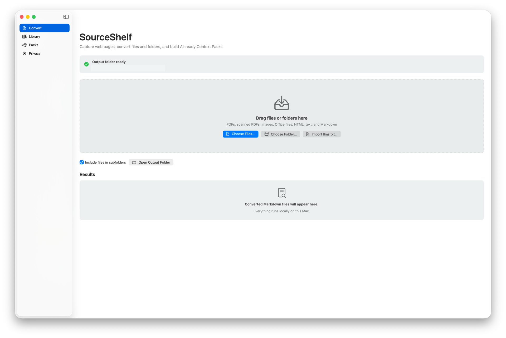
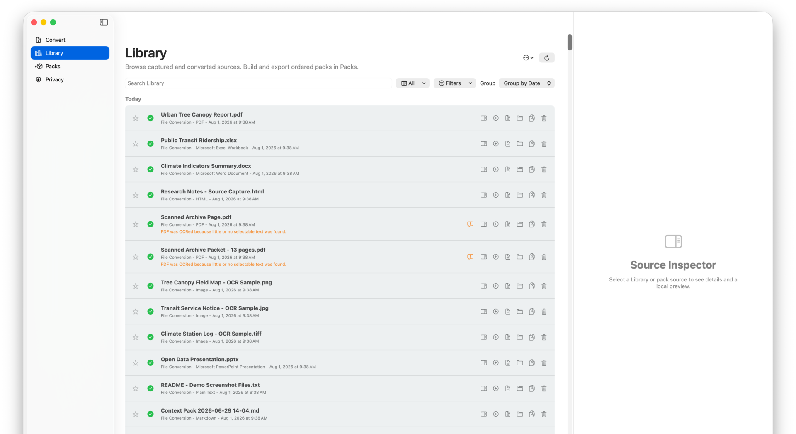
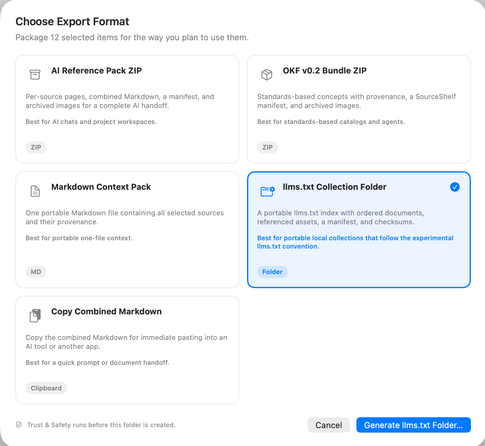

# Começar a usar o SourceShelf

Esta orientação passo a passo converte alguns arquivos, cria um pacote ordenado, verifica-o e exporta-o.

## 1. Escolha uma pasta de saída

aberto **SourceShelf > Configurações > Geral** e escolha uma pasta de saída. O Markdown convertido é salvo lá. SourceShelf lembra o acesso à pasta para que conversões posteriores possam usá-la sem outra solicitação.

Escolha uma pasta que seja fácil de reconhecer e fazer backup. O SourceShelf também mantém os metadados locais da Biblioteca e ativos gerenciados em seu contêiner de aplicativos; alterar a pasta de saída não move os arquivos Markdown mais antigos.

## 2. Converter arquivos

Abra **Converter**, arraste os arquivos para a área ou escolha **Selecionar arquivos**. Você também pode usar **Arquivo > Abrir**, converter uma pasta inteira ou escolher **Importar pacote de pesquisa…** para importar um pacote do SourceShelf, um ZIP OKF, um pacote portátil `llms.txt`, um arquivo `llms.txt` independente ou uma pasta que contenha `llms.txt`.

Cada conversão bem-sucedida cria:

- Um arquivo Markdown na pasta de saída;
- Uma entrada da Biblioteca com seu título, tipo de fonte, datas e disponibilidade;
- Metadados semânticos gerenciados usados por pré-visualizações, agrupamento e comparação;
- Ativos arquivados quando o formato de origem ou captura inclui imagens suportadas.

O arquivo original não é alterado.

## 3. Revise a Biblioteca

aberto **biblioteca**. Os itens recém-convertidos aparecem no topo quando agrupados por data. Selecione um item para abrir o inspetor. uso **pré-visualização** Para conteúdo renderizado e **Fonte Markdown** Para o Markdown armazenado exato, incluindo o front matter YAML.

Os filtros da biblioteca afetam apenas o que você vê. Eles não alteram o pacote atual.

## 4. Construa um pacote

Abra **Pacotes**. O navegador esquerdo lista os pacotes salvos e o campo **Pesquisar pacotes** permite filtrá-los localmente por nome. Escolha **Novo pacote** e depois **Adicionar fontes** na coluna central. A pesquisa de pacotes e a pesquisa de fontes são independentes. Adicione fontes individuais ou use:

- **Adicionar correspondência** Para os filtros atuais;
- **Adicionar tudo exportável** Para cada item da Biblioteca legível;
- **Adicionar desde a última exportação** Para itens capturados ou convertidos após a última exportação bem-sucedida.

Mude para **Conteúdo** e reordene a lista arrastando os itens ou usando **Mover para cima** e **Mover para baixo**. A ordem exibida se torna a ordem de exportação e a ordem apresentada pelo Acesso Local de IA.

Salve o pacote para dar a ele um nome permanente. **Salvar alterações**, **Atualizar e comparar**, **Confiança e Segurança** e **Exportar…** permanecem visíveis. Use **Ações do pacote** para Salvar como, Renomear, Acesso Local de IA e Excluir.

## 5. Executar Confiança e Segurança

selecionar **Confiança e Segurança**. SourceShelf verifica a legibilidade da fonte, nomeação e estrutura do pacote, datas de modificação, idade da fonte da web, referências de ativos, hashes de conteúdo e padrões conservadores que podem indicar linguagem de injeção de prompt.

Os avisos são apenas orientativos. A SourceShelf preserva o conteúdo original e o rotula como material de referência não confiável; ela não afirma que o higienize.

## 6. exportação

selecionar **Exportar...**, então escolha o destino que combina com seu fluxo de trabalho:

- **Pacote de Referência de IA ZIP** Para chats de IA, agentes e espaços de trabalho de projetos;
- **OKF v0.2 Pacote ZIP** Para catálogos e agentes baseados em padrões;
- **Pacote de contexto Markdown** Para um arquivo portátil;
- **Pacote portátil llms.txt ZIP** para uma coleção completa que pode ser movida entre dispositivos com o SourceShelf;
- **llms.txt Pastinha de Coleção** Para uma pasta organizada e inspecível;
- **Copiar Markdown combinado** Para uma colagem rápida.

CEP e `llms.txt` As exportações de pastas executam uma verificação de Confiança e Segurança nova. As exportações de Markdown e área de transferência começam imediatamente. Uma exportação bem-sucedida registra uma linha de base local para **Atualizar e comparar**.

## Próximos passos

- Capture pesquisas na web com [A extensão do Safari](guides/safari-capture.md).
- Conecte um pacote salvo a um aplicativo local de IA com [Acesso local de IA](mcp/local-ai-access.md).
- Saiba o que cada pacote contém em [Escolha um formato de exportação](guides/export-formats.md).
- Aprenda como a retenção e a limpeza funcionam em [Gerenciar o armazenamento do SourceShelf](guides/storage-management.md).
