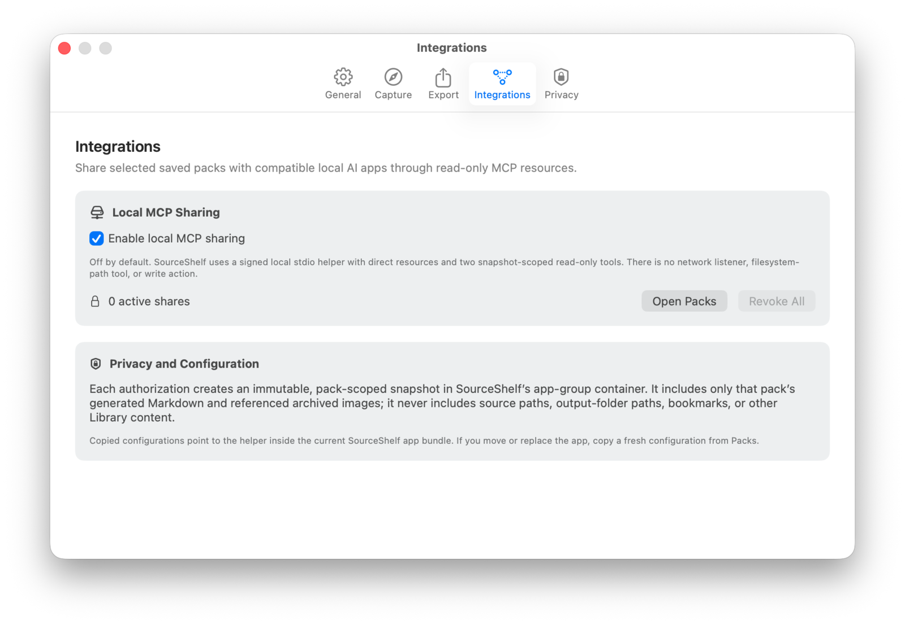
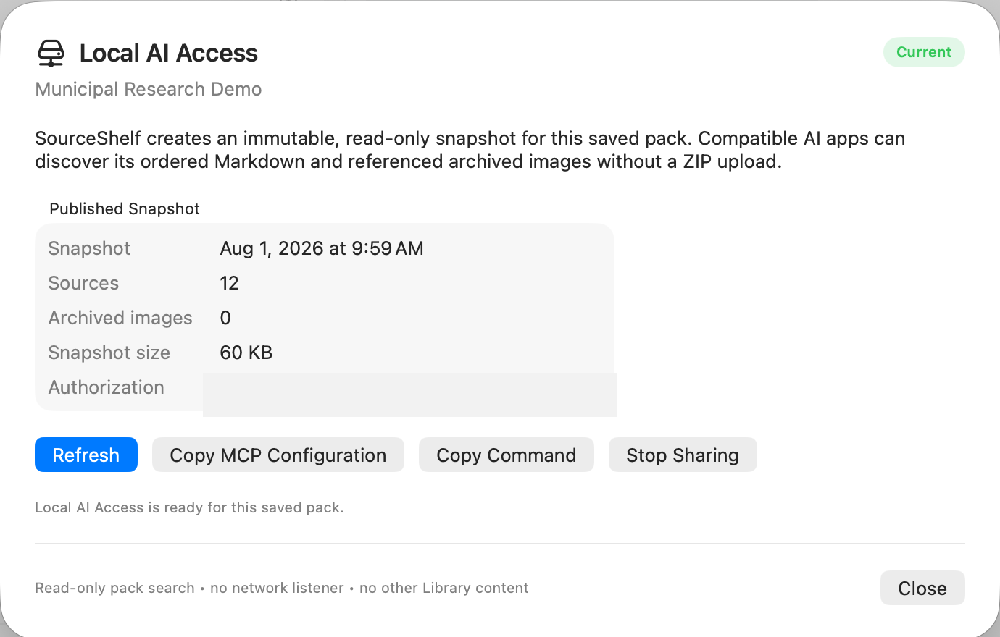

# Local AI Access (MCP)

Local AI Access lets a compatible AI application search and read one saved SourceShelf pack without repeatedly exporting and uploading it. Sharing is local, read-only, pack-scoped, and off by default.

SourceShelf uses the Model Context Protocol (MCP) over standard input/output. It does not start a web server or network listener.

## Before you connect a client

1. Open **SourceShelf > Settings > Integrations**.
2. Enable **Local MCP sharing**.
3. Open **Packs** and select a saved pack.
4. Save any outstanding changes.
5. Choose **More > Local AI Access…**.
6. Review the fresh Trust & Safety result. If it has warnings or readable-source errors, explicitly choose **Share with Issues** to continue.

An untitled or dirty pack cannot be shared. A pack with no readable sources is blocked.

## What SourceShelf publishes

Each authorization creates a random share ID and an immutable snapshot containing only the selected pack:

- a pack overview with ordered source links;
- a generated `llms.txt` index;
- a public JSON catalog;
- one Markdown resource per readable source;
- referenced archived images;
- checksums and an internal URI allowlist.

The snapshot does **not** include source-file paths, output-folder paths, security bookmarks, unrelated Library items, or write access.

Text reads prepend an untrusted-reference notice without changing the stored Markdown body. Every requested URI is checked against the snapshot allowlist and its SHA-256 checksum before it is served.

## Resources and tools

The server exposes discoverable `sourceshelf://pack/...` resources and two read-only tools:

### `search_pack(query, limit)`

Searches the shared pack locally and returns ranked excerpts plus resource URIs. Search is deterministic and lexical; it does not use embeddings, make network requests, or call a model.

### `read_pack_resource(uri, cursor, max_characters)`

Reads a text resource in bounded pages. The cursor lets a client continue through a long source without overfilling a smaller model’s context window.

This pair is especially useful for local models: the model can search narrowly, read only the most relevant source sections, and cite their SourceShelf URIs. A compatible host still needs to let the model call tools.

## Copy the connection details

The **Local AI Access** sheet provides:

- **Copy MCP Configuration** — JSON in the common `mcpServers` format used by LM Studio and several clients;
- **Copy Command** — the helper executable plus `--share` authorization argument;
- **Refresh** — rebuild the snapshot after an explicit review when needed;
- **Stop Sharing** — revoke the authorization immediately.

Treat the copied share ID like a local access token. It is not a password sent over the internet, but any process running as your user that has the ID and helper path can request that snapshot.

## Snapshot refresh and revocation

SourceShelf re-evaluates shares after relevant pack, Library, and trust-policy changes:

- If a fresh Trust & Safety result is ready, SourceShelf can replace the snapshot automatically.
- If new warnings or errors appear, the previous valid snapshot stays available and the share becomes **Review Required**.
- Select **Refresh** and confirm before publishing those changes.
- Deleting the saved pack revokes its share.
- **Stop Sharing**, **Revoke All**, or disabling Local MCP sharing invalidates copied configurations immediately.

The helper reloads registry and snapshot metadata for every request, so a running client cannot keep reading a revoked share.

## Moving or replacing SourceShelf

Copied configurations point to the helper inside the current SourceShelf app bundle. If you move the app, replace a debug build with a release build, or switch between TestFlight and local builds, copy a fresh configuration from the intended app.

## Choose a client guide

- [LM Studio](lm-studio.md)
- [Ollama](ollama.md)
- [Codex](codex.md)
- [Claude Code](claude-code.md)
- [OpenCode](opencode.md)

See [MCP troubleshooting](troubleshooting.md) if the helper exits, tools are missing, or a share is not current.

## Protocol notes

SourceShelf’s helper uses MCP over stdio and supports the protocol version implemented by its bundled Swift SDK. The server publishes resources and the two read-only tools only; it does not publish prompts, write tools, subscriptions, or list-change notifications.

Further reading: [MCP resources](https://modelcontextprotocol.io/docs/learn/server-concepts), [MCP tools](https://modelcontextprotocol.io/docs/learn/server-concepts#tools).
